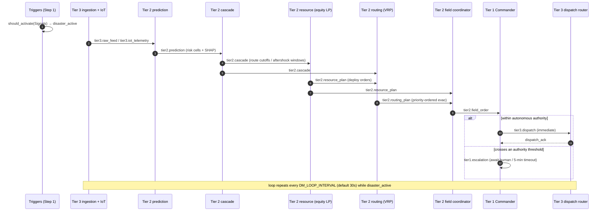
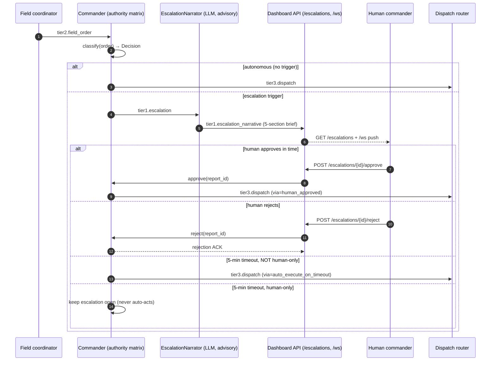
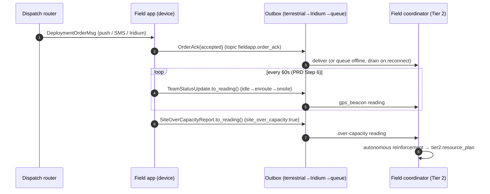
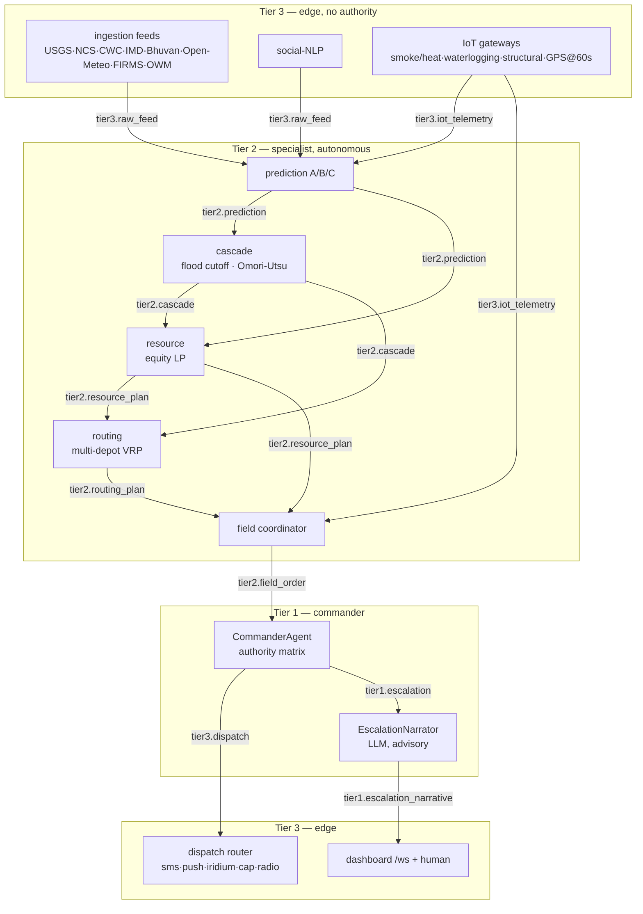

# DisasterMind — Sequence & Dataflow Diagrams

Mermaid diagrams for the autonomous coordination loop, the human-escalation
flow, and the field-device round-trip. Message labels are the real topic names
from `core/contracts.py::Topic`. These render natively on GitHub.

> Source of truth: `orchestration/loop.py`, `tier1/commander/`, `tier2/*`,
> `tier3/*`, `llm/narrator.py`, `api/`, and `fieldapp/contracts.py`.

---

## 1. Autonomous coordination loop (Steps 1–10)

One 30-second cycle of `CoordinationLoop.run_once()`. Every hop is a publish to a
topic on the single `MessageBus`; agents never call one another directly.

---

## 2. Escalation flow (Step 7)

How a threshold-crossing order reaches a human, the advisory LLM brief, and the
two terminal paths (auto-execute on timeout vs. human-only hold).

The human-only triggers (`international_aid_request`, `declare_state_of_emergency`,
`armed_forces_in_civil_situation`, `critical_national_infrastructure`) are the
`HUMAN_ONLY_TRIGGERS` frozenset — the Commander never auto-executes them.

---

## 3. Field-device round-trip (Steps 6 & 8)

The web console's Field Ops module (`clients/web/`, `src/modules/field/`)
exercises the field-device contracts in `fieldapp/contracts.py`. Emissions ride
the durable outbox: terrestrial first, then Iridium satellite fallback, then
offline queue (Step 10).

---

## Topic dataflow

The full publish/subscribe graph (compact form of the ASCII diagram in
[`architecture.md`](./architecture.md#5-topic-dataflow)).

